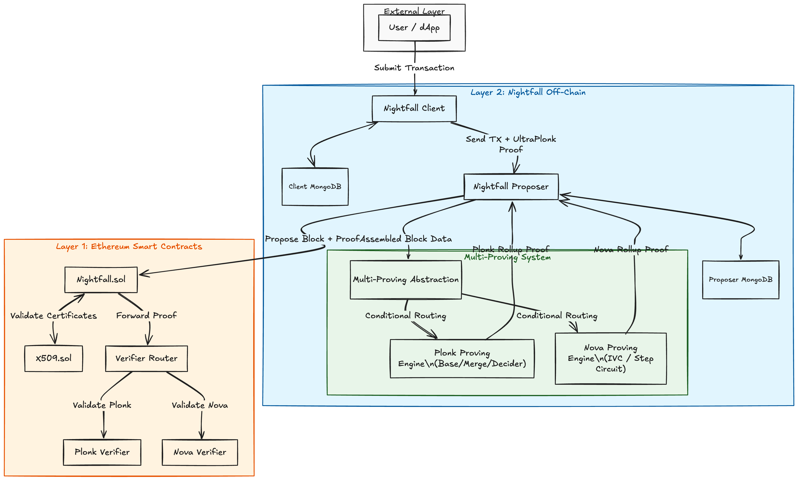

# Nightfall 4

Nightfall 4 enables the secure and private transfer of various token standards, including ERC-20, ERC-721, ERC-1155, and ERC-3525. By leveraging ZK cryptography, it groups transactions into succinct Layer 2 blocks, drastically reducing gas costs while preserving the confidentiality of transaction data.

This experimental fork extends the core Nightfall protocol with a modular **Multi-Proving System**:
- **Dynamic Proving Backends:** Seamlessly switch between the **Nova** and **PLONK** proving systems based on configuration.
- **Architectural Flexibility:** Abstractions allow different proving backends to generate Rollup proofs independently without changing the core block assembly logic.

## Documentation

Comprehensive details regarding the architecture, APIs, local installation, and testnet deployment can be found in the [Documentation](doc/nf_4.md).

## Disclaimer

> This software is experimental and intended for research, development, and community evaluation. **It should not be used in production environments or to process significant value transactions.**

